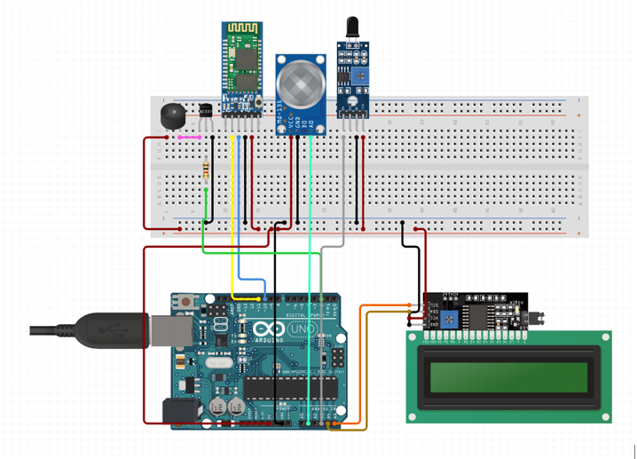
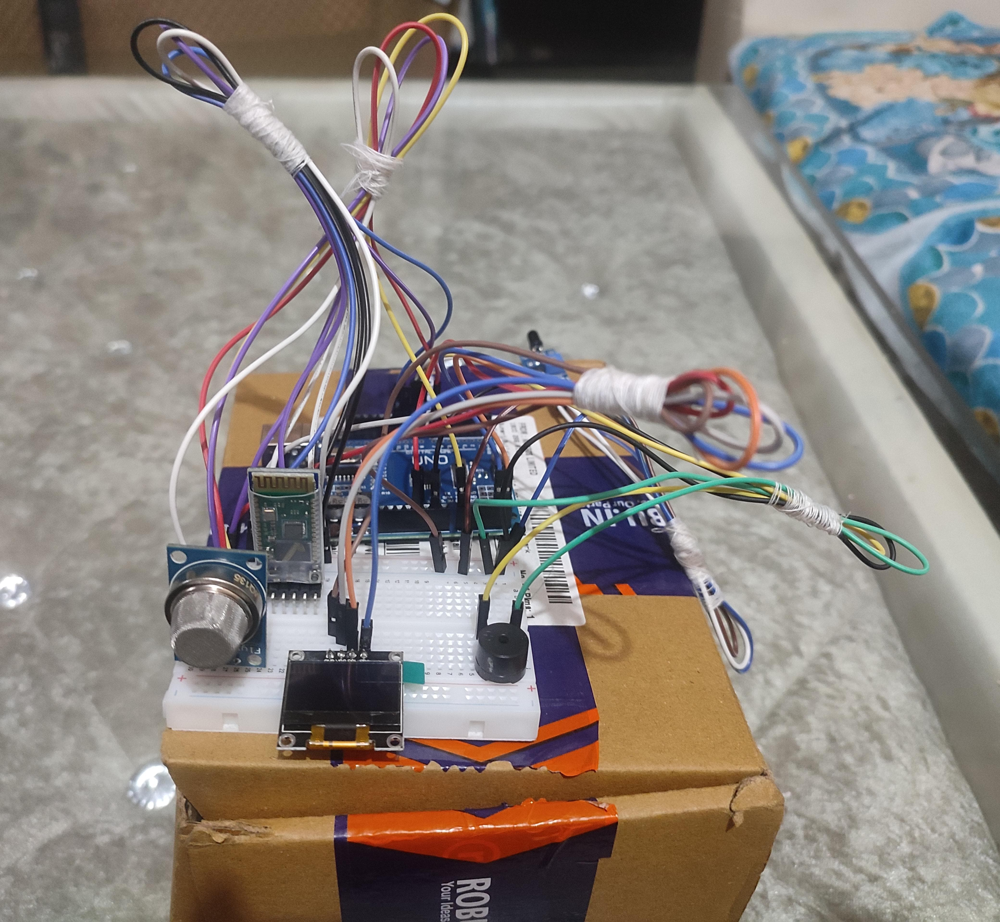

<b>🔥 Smart Safety System using Arduino</b>

An Arduino-based safety system designed to detect **gas leaks** and **flames**, provide real-time alerts using a buzzer, OLED display, and Bluetooth communication. Ideal for use in homes, kitchens, or industrial environments where fire and gas threats must be monitored continuously.

---

<b>📌 Features </b>

- ✅ <b>MQ-135 Gas Sensor</b> – Detects air pollution and harmful gases
- 🔥 <b>IR Flame Sensor</b> – Detects fire or flame presence
- 🔊 <b>Buzzer</b> – Emits a loud beep when flame or gas is detected
- 📺 <b>OLED Display (SSD1306)</b> – Displays gas value and flame alert
- 📡 <b>Bluetooth (HC-05)</b> – Sends alerts to a connected mobile device
- 🧠 <b>Serial Monitor Support</b> – For debug and live status messages

---

<b>🔧 Components Used</b>

| Component         | Quantity |
|------------------|----------|
| Arduino Uno      | 1        |
| MQ-135 Sensor    | 1        |
| IR Flame Sensor  | 1        |
| OLED Display     | 1        |
| HC-05 Bluetooth Module | 1 |
| Buzzer           | 1        |
| Breadboard + Jumpers | 1 set  |
| Power Source     | USB / Battery |

---

<b>⚙️ How It Works</b>

1. MQ-135 constantly reads air quality levels.
2. Flame sensor checks for IR light (from flame/fire).
3. If unsafe gas or flame is detected:
   - Buzzer beeps using `tone()`
   - OLED shows real-time alert
   - Bluetooth sends a warning to your phone
   - Serial Monitor also logs the event

---

<b> Circuit Diagram</b>

---

<b> Prototype Image</b>

---

## 💻 How to Upload Code

1. Open **Arduino IDE**
2. Select your board: *Arduino Uno*
3. Go to `File > Open` and select `smart_safety_system.ino`
4. Click **Upload**
5. Open **Serial Monitor** to see output

---

## 📱 Bluetooth Setup

1. Pair phone with **HC-05** (default password: `1234` or `0000`)
2. Use any app like **Serial Bluetooth Terminal**
3. Alerts will show up automatically when triggered

---

## 🧪 Testing Instructions

- ✅ **Gas**: Use deodorant, perfume, or smoke near MQ-135
- ✅ **Flame**: Use a lighter (carefully) near the flame sensor
- ✅ **Serial Monitor**: See alerts in real-time
- ✅ **OLED Display**: Confirms detection visually
- ✅ **Buzzer**: Beeps if danger is detected

---

## 📈 Future Improvements

- 🌐 Add IoT support using ESP8266
- 📲 Custom Android App using MIT App Inventor
- 🔋 Battery-powered compact design
- 💾 Add SD card module for data logging

---

## 👨‍💻 Author

**Rudraksh Sachdeva**  
B.Tech CSE @ [IILM University, Gurugram]  
GitHub: [RudrakshSachdev]  

